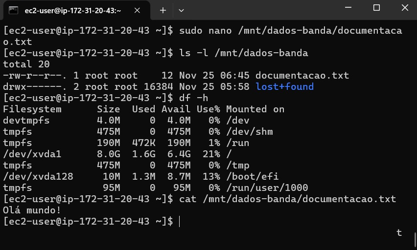

# Criando e Gerenciando Volumes EBS no EC2

Este repositório documenta o processo de criação, anexo, formatação e montagem de um volume EBS em uma instância EC2 com Amazon Linux 2.

## Passos

1. **Criar a instância EC2:**
   - Acesse o console da AWS e navegue até o serviço EC2.
   - Crie uma nova instância EC2 com Amazon Linux 2.
   - Escolha o tipo de instância e configure as opções de segurança (grupo de segurança).

2. **Criar o volume EBS:**
   - No console do EC2, vá em "Volumes" e clique em "Criar Volume".
   - Escolha o tipo de volume (gp3 recomendado), tamanho, zona de disponibilidade (mesma da instância) e crie o volume.

3. **Anexar o volume à instância:**
   - Selecione o volume criado e clique em "Ações" > "Anexar volume".
   - Escolha a instância e o dispositivo (anote o nome do dispositivo, ex: `/dev/xvdf`).

4. **Conectar à instância via SSH:**
   - Use o comando `ssh` com a chave privada para se conectar à instância.

5. **Formatar o volume:**
   ```bash
   sudo mkfs -t ext4 /dev/xvdf  # Substitua /dev/xvdf pelo dispositivo correto
   ```

6. **Criar o ponto de montagem:**
   ```bash
   sudo mkdir /mnt/dados-banda
   ```

7. **Montar o volume:**
   ```bash
   sudo mount /dev/xvdf /mnt/dados-banda
   ```

8. **Criar um arquivo de teste:**
   ```bash
   sudo touch /mnt/dados-banda/documentacao.txt
   ```

9. **Editar o arquivo com nano:**
   ```bash
   sudo nano /mnt/dados-banda/documentacao.txt
   ```
   - Digite "Olá Mundo!" dentro do nano.
   - Salve e saia: Ctrl+X, Y, Enter.

10. **Verificar:**
   ```bash
   ls -l /mnt/dados-banda
   df -h
   mount | grep dados-banda
   cat /mnt/dados-banda/documentacao.txt
   ```

11. **Desanexar e excluir o volume (após o teste):**
    - No console do EC2, desanexe o volume da instância.
    - Exclua o volume.

12. **Encerrar a instância:**
    - No console do EC2, encerre a instância.

## Print de confirmação



## Conclusão

Este processo demonstra como criar, anexar, formatar, montar e usar um volume EBS em uma instância EC2.  A documentação e os comandos fornecidos permitem que outros desenvolvedores reproduzam os passos e compreendam o gerenciamento de armazenamento no EC2.

## Autor

[Artur Costa] - (https://github.com/arturcosta86)

